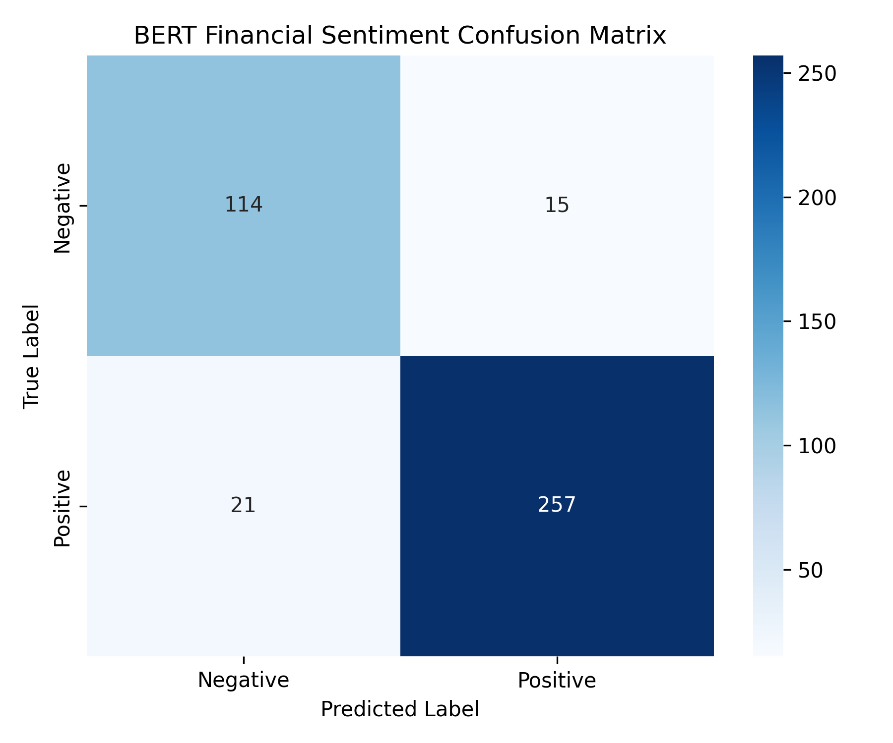

# Financial Sentiment Analysis Pipeline

A production-grade, modular PyTorch pipeline fine-tuning a bidirectional `bert-base-uncased` Transformer model for financial market binary sentiment classification (Positive vs. Negative).

## Project Architecture & Structure

```text
├── assets/
│   ├── confusion_matrix.png                   # Visual confusion matrix of validation predictions
│   └── metrics.json                           # Serialized evaluation metrics and benchmark stats
├── notebooks/
│   └── Transformation_Sentiment_Pipeline.ipynb      # Interactive prototyping, EDA, and metrics exploration
├── data_preprocessing.py                      # Dataset loading, neutral-class filtering, and tokenization pipeline
├── train.py                                   # BERT-base model initialization and training loop
├── evaluate.py                                # Comprehensive model evaluation, metrics calculation, and artifact generation
├── inference.py                               # Single-sequence inference and latency benchmarking script
├── requirements.txt                           # Environment dependencies
└── README.md                                  # Project documentation
```

## Key Performance Benchmarks

| Metric / Benchmark | Value / Specification |
| :--- | :--- |
| **Model Architecture** | `BERT-base-uncased` (110M parameters) |
| **Test Accuracy** | 91.15% |
| **Binary F1-Score** | 0.9345 |
| **Inference Latency** | 12.76 ms (NVIDIA T4 GPU) \| 171.65 ms (x86 CPU) |
| **Model Footprint** | 417.7 MB |

## Model Evaluation

The fine-tuned BERT model was evaluated on a held-out validation dataset to assess classification performance across positive and negative financial market sentiments:



## Quickstart & Setup

1. **Clone the repository:**
   ```bash
   git clone https://github.com/YOUR_USERNAME/financial-sentiment-pipeline.git
   cd financial-sentiment-pipeline
   ```

2. **Install dependencies:**
   ```bash
   pip install -r requirements.txt
   ```

3. **Run Preprocessing & Training:**
   ```bash
   python data_preprocessing.py
   python train.py
   ```

4. **Evaluate Model & Generate Artifacts:**
   ```bash
   python evaluate.py
   ```
   *Runs model evaluation on the validation split and exports `assets/confusion_matrix.png` and `assets/metrics.json`.*

5. **Benchmark Inference Latency:**
   ```bash
   python inference.py
   ```